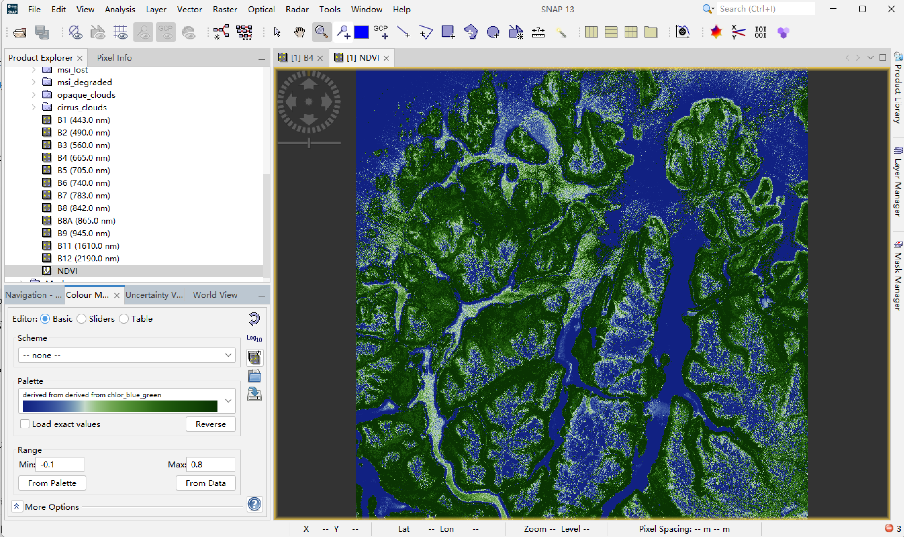

class: center, middle

# Week 2 Practical
## Remote sensing workflow in SNAP

---

## Practical objective

- Open raw satellite product (**.SAFE**)
- Understand product structure & metadata
- Visualise bands and create **Natural Colour RGB**
- Export outputs for interpretation / reporting

---

## Data used

- Satellite imagery distributed as a structured product (**SAFE format**)
- Contains multiple spectral bands + metadata
- Not directly viewable like a normal photo without specialist software

---

## Tool: SNAP

**SNAP (Sentinel Application Platform)** is a dedicated tool for Earth Observation data.

Why SNAP in this practical?
- Reads SAFE products directly
- Supports band handling and composites
- GUI workflow is suitable for beginners learning EO pipelines

---

## Step 1: Open & understand the product

- Load the `.SAFE` folder into SNAP
- Inspect the product structure and metadata
- Explore the available spectral bands

---

## Step 2: Visualisation

- View individual bands
- Create **Natural Colour RGB** (e.g., 4-3-2)
- Adjust contrast / stretch for interpretation

---

## Step 3: Output

- Produce interpretable imagery outputs
- Export for portfolio reporting and/or downstream analysis

---

## What I learned

- A satellite “image” is not a single file: structure and metadata matter
- Band combinations strongly influence how surface features are interpreted
- Visualisation is a necessary step before any quantitative analysis

**Limitations**
- GUI-based workflows (e.g. SNAP) are difficult to fully reproduce step-by-step
- Processing choices can be implicit if not carefully documented

**Next steps**
- Export outputs in standard formats for integration with R or Python
- Move towards more reproducible, script-based workflows

