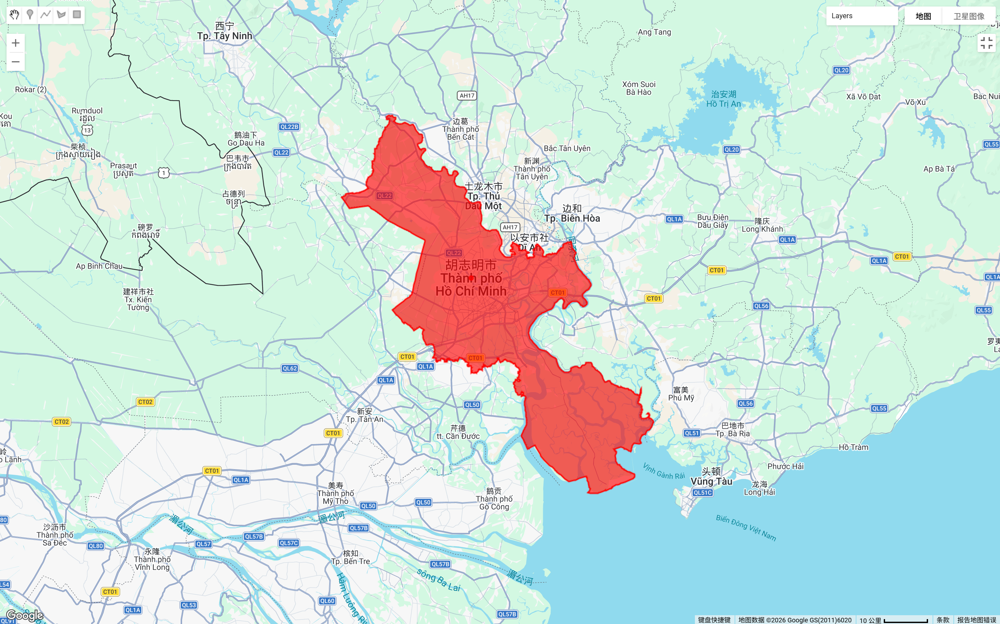
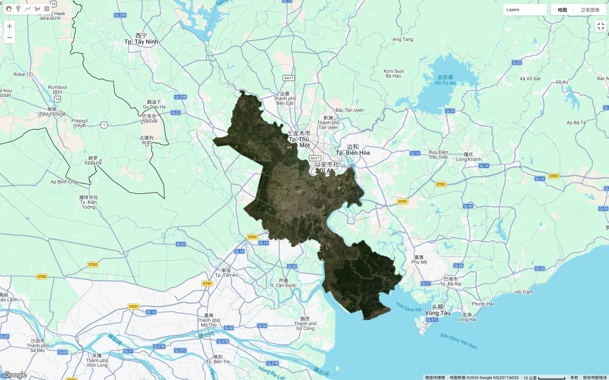
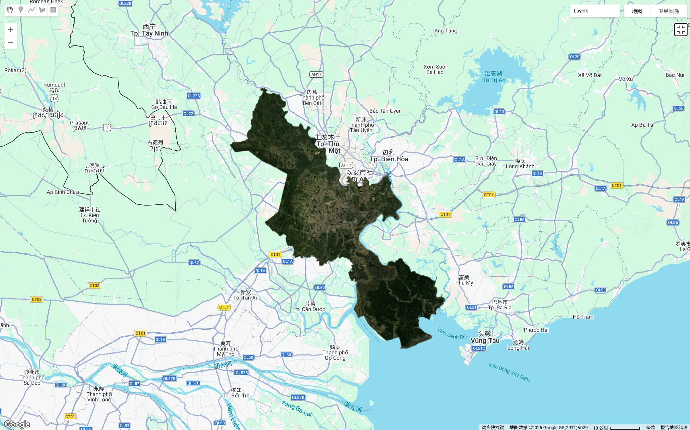
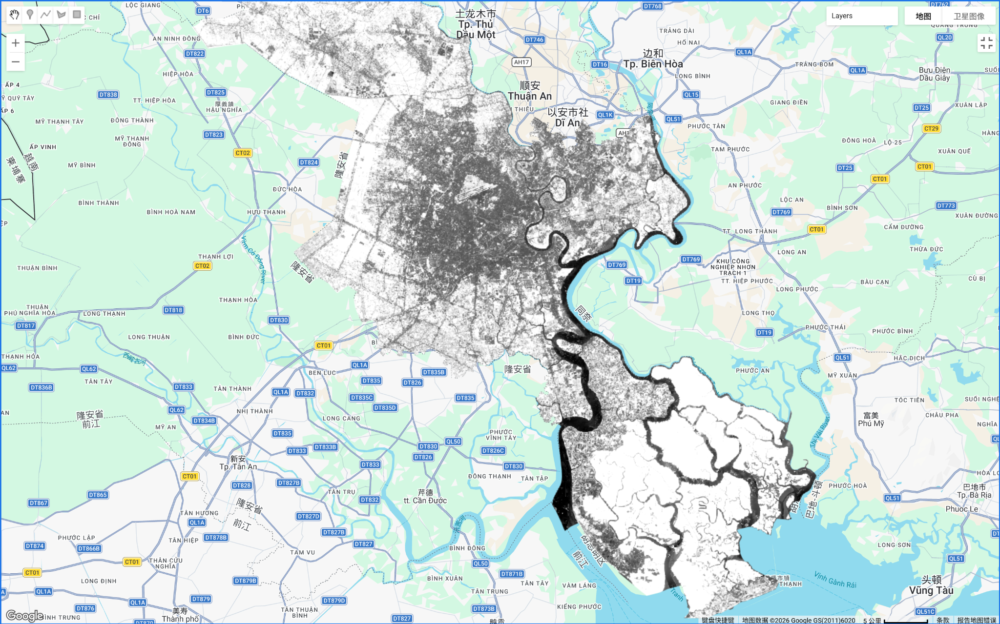

## Summary

This week’s practical focused on multi-temporal image compositing and vegetation index analysis using Landsat 8 Collection 2 Level 2 surface reflectance data in Google Earth Engine (GEE). I selected Ho Chi Minh City (2023–2024) as my study area in order to explore how different compositing strategies influence image clarity and NDVI derivation in a humid tropical urban environment.

The workflow began by filtering the Landsat 8 image collection by spatial boundary (Ho Chi Minh City administrative boundary) and temporal range (January 2023 to December 2024). A scene-level cloud cover threshold (<40%) was applied to exclude highly contaminated scenes. Surface reflectance scale factors were then implemented to convert raw digital numbers into physically meaningful reflectance values.

To evaluate compositing strategies, I first generated a baseline RGB composite using a simple temporal median without applying pixel-level QA cloud masking. This image allowed me to observe how much atmospheric contamination remains when only scene-level filtering is used. While the urban structure was clearly visible, subtle haze and tonal inconsistencies were still present, especially in coastal and vegetated areas.

Next, I applied QA bitmask filtering to remove cloud-contaminated pixels prior to compositing. In addition, I calculated NDVI and implemented an NDVI-based `qualityMosaic` approach, which prioritises pixels with higher vegetation values when constructing the final composite. This produced a noticeably clearer RGB image with improved contrast and spatial consistency.

Finally, NDVI was derived from the refined composite using the standard formulation (NIR − Red) / (NIR + Red). The resulting NDVI map clearly distinguishes vegetated areas, dense urban cores, and water bodies across the metropolitan region.

This comparison demonstrates that compositing strategy selection significantly influences both visual quality and analytical outputs in tropical remote sensing applications.

## Applications

Cloud contamination remains one of the primary constraints in optical remote sensing, particularly in equatorial and tropical regions where persistent cloud cover limits usable observations. Many studies relying on Landsat or Sentinel imagery implement pixel-level quality masking and multi-temporal compositing to overcome this limitation. Roy et al. (2014) emphasise the importance of the Landsat Collection quality assessment bands for maintaining radiometric consistency and reliability across time series datasets. Automated cloud detection approaches, such as those discussed by Zhu and Woodcock (2012), further enhance the robustness of compositing workflows.

In urban environmental research, improved compositing directly affects downstream analyses such as land cover classification, urban heat island mapping, vegetation monitoring, and floodplain delineation. NDVI-based compositing is particularly useful in ecological and urban greening studies because it prioritises vegetation-rich pixels, often resulting in visually cleaner outputs. However, this method may introduce subtle bias by favouring vegetated surfaces over built-up areas, potentially influencing spectral representation in dense urban cores. This highlights the importance of methodological transparency when integrating Earth Observation data into environmental monitoring frameworks or policy-driven assessments.

## Reflection

This practical changed my perception of image compositing from being a routine preprocessing step to a methodological decision that shapes analytical interpretation. In a cloud-prone tropical city such as Ho Chi Minh City, simple median compositing is insufficient for producing stable outputs. While NDVI-based quality mosaicking clearly improves image clarity, it may also prioritise certain land cover types, influencing downstream analyses. In future work, I would consider comparing percentile-based or median-of-best-pixels approaches to further evaluate compositing trade-offs. Overall, this exercise strengthened my understanding of how preprocessing decisions directly affect the reliability and credibility of urban remote sensing analysis.

