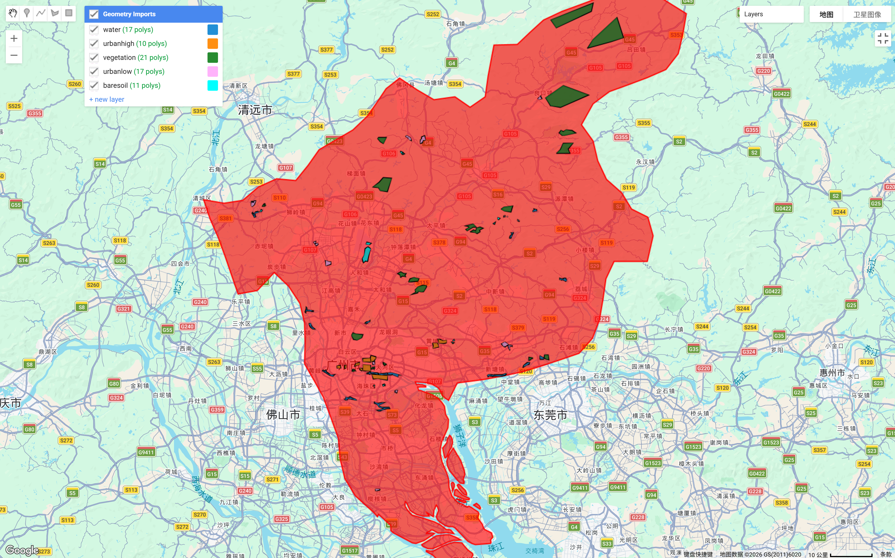

### Summary

This week’s practical focused on supervised image classification using Sentinel-2 imagery in Google Earth Engine (GEE). The aim of the exercise was to understand how satellite imagery can be processed and classified into different land-cover types using machine learning methods.

I selected **Guangzhou, China** as the study area because it is my hometown. Using a familiar city made it easier to recognise important geographical features such as the Pearl River, urban districts and mountainous areas. Guangzhou is located in the Pearl River Delta and contains a mixture of dense urban areas, vegetation, rivers and construction sites, making it suitable for land-cover classification.

To generate cloud-free Sentinel-2 imagery, two different compositing approaches were tested.

The first approach filtered scenes using the **CLOUDY_PIXEL_PERCENTAGE** metadata variable and retained only images with less than 5% cloud cover before generating a median composite. This approach is computationally simple but may discard many potentially useful images.

The second approach applied **pixel-level cloud masking** using the QA60 band to remove cloud and cirrus pixels before creating the composite image. Compared with scene-level filtering, this method allows more images to be used while masking only cloudy pixels, which generally results in a more complete composite.

After generating the composite image, training polygons were manually digitised for five land-cover classes: **urban_high, urban_low, vegetation, water and bare soil**. These training samples were used to extract spectral information from Sentinel-2 bands and train a **CART (Classification and Regression Tree)** classifier.

The trained model was then applied to classify the entire study area.

The classification map shows several clear spatial patterns. Vegetation is mainly distributed in the mountainous northern areas of Guangzhou, while the central and southern parts of the city are dominated by urban land cover. Major water bodies such as the Pearl River are also clearly detected in the classification result.

---

### Applications

Supervised classification is widely used in remote sensing to map land cover and monitor environmental change. With platforms such as Google Earth Engine, large satellite datasets can be processed efficiently without downloading imagery locally.

This type of workflow can be applied to analyse **urban expansion, vegetation change or land-use dynamics** over time. In rapidly developing cities such as Guangzhou, remote sensing classification could help identify patterns of urban growth and environmental change. Such analyses can support urban planning, environmental monitoring and sustainability studies.

In addition, cloud-based geospatial platforms significantly simplify the remote sensing workflow. Image filtering, cloud masking, training sample creation and classification can all be conducted within a single environment, which greatly improves analytical efficiency.

---

### Reflection

This practical helped me better understand the workflow of supervised classification using satellite imagery. During my undergraduate studies I performed similar classification tasks using **ArcGIS**, where the general concept is comparable but the workflow is more fragmented. In ArcGIS, satellite imagery often needs to be downloaded and pre-processed locally before classification can be applied. In contrast, Google Earth Engine provides direct access to large satellite datasets and allows the entire process to be performed in the cloud, making the workflow much more efficient.

However, the classification results also reveal some limitations. In particular, the distinction between **urban_high** and **urban_low** is not very clear, and many areas appear to be classified as urban_high. This likely reflects the fact that the spectral characteristics of different urban surfaces are quite similar in Sentinel-2 imagery, which makes it difficult for a simple CART classifier to separate them accurately.

In future analyses, this limitation could potentially be improved by increasing the number of training samples, refining the training polygons, or applying more advanced classifiers such as **Random Forest**. Despite these challenges, the exercise demonstrates how supervised classification can quickly produce land-cover maps at the city scale.