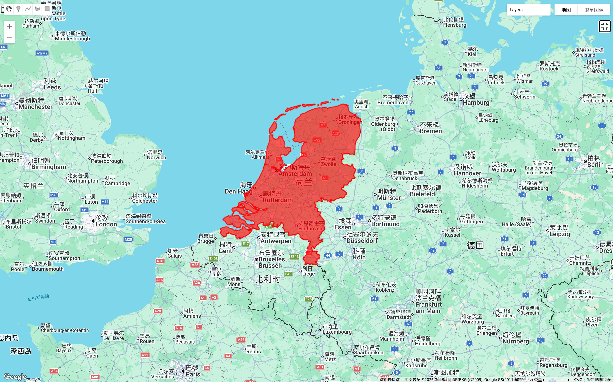
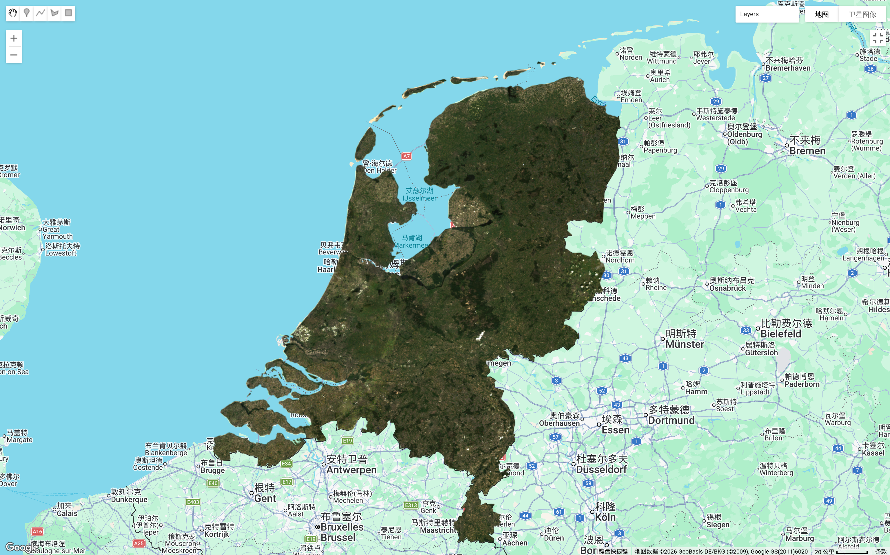
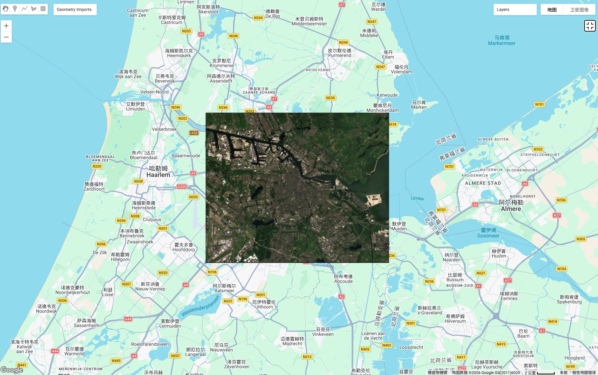
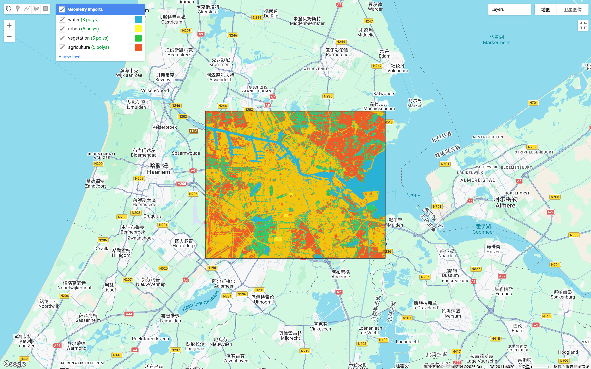
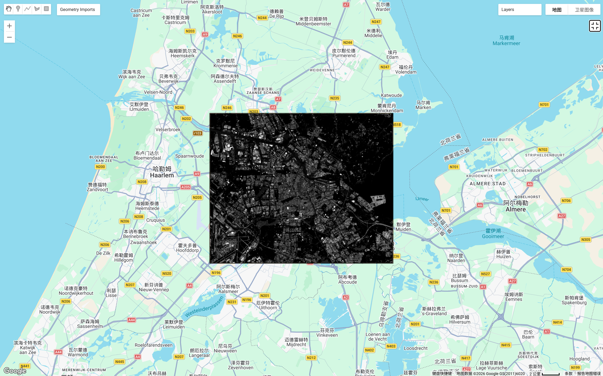
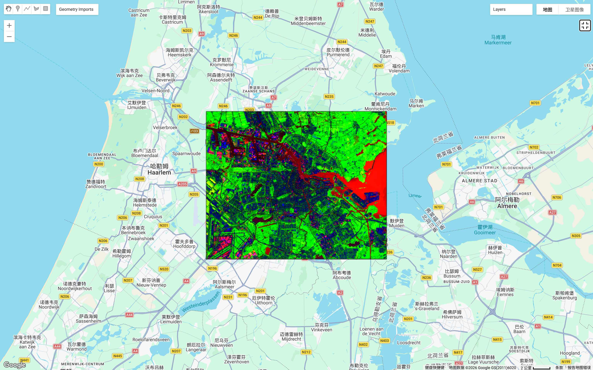

# Week 7 – Classification II

## Introduction

This week focused on more advanced classification techniques in Google Earth Engine, particularly spectral unmixing and sub-pixel classification. Compared to Week 6, where each pixel was assigned a single class, this method allows each pixel to contain multiple land cover types. This is especially useful in urban areas where land cover is often mixed.

For this week, I initially decided to use the Netherlands as my study area. One reason for choosing the Netherlands is that I am planning to travel there during the Easter holiday. Using a location that I am interested in made the learning process more engaging and meaningful.

## Study Area Selection

At first, I attempted to classify the entire Netherlands.

However, I quickly realised that using such a large study area created several challenges. The classification process became slow, and the results were less reliable. The Netherlands contains diverse landscapes including agricultural land, urban areas, wetlands and coastal environments. This made it difficult to create representative training samples.

To better understand the spatial variation, I visualised satellite imagery for the entire Netherlands.

From this image, it became clear that using the entire country was not practical. Therefore, I decided to narrow the study area.

## Focusing on Amsterdam

After reviewing the dataset, I selected Amsterdam and its surrounding areas as my final study area.

This region contains a mix of urban areas, vegetation, water bodies and agricultural land. This makes it suitable for classification exercises. I then manually digitised training polygons for four land cover classes:

- Water  
- Urban  
- Vegetation  
- Agriculture  

This step followed the supervised classification workflow introduced in Week 6.

## Supervised Classification

After generating training samples, I applied Random Forest classification to produce a land cover map.

The classification result shows that urban areas are concentrated in central Amsterdam, while agricultural land dominates surrounding regions. Water bodies were also clearly identified. However, I noticed that some mixed areas were poorly classified. This is because traditional classification forces each pixel to belong to only one category.

This limitation led to the introduction of spectral unmixing, which is the main focus of Week 7.

## Spectral Unmixing

To improve classification accuracy, I applied spectral unmixing. This method estimates the proportion of different land cover types within each pixel.

This figure shows mixed land cover distributions. For example, urban fringe areas contain a mixture of vegetation and built-up land. These mixed pixels were not captured in the previous classification.

Compared to Week 6, this method provides more detailed information about land cover composition.

## Fraction Map

To further explore the spectral unmixing results, I visualised a composite fraction map using RGB colours. In this map, red represents urban fraction, green represents vegetation fraction, and blue represents water fraction.

This composite map reveals mixed land cover patterns more clearly than traditional classification. Areas with strong red tones indicate dominant urban land cover, while green areas represent vegetation-dominated regions, and blue areas correspond to water bodies. Mixed colours, such as yellow or purple, indicate pixels containing multiple land cover types.

For example, urban fringe areas often appear as mixed colours, suggesting a combination of built-up land and vegetation. This demonstrates how spectral unmixing captures sub-pixel variability that was not visible in the Week 6 classification.

Compared to traditional classification, spectral unmixing provides more detailed spatial information and helps identify transitional areas between land cover types.

## Reflection

This week was more challenging compared to previous weeks, but also more interesting. At the beginning, I tried to classify the entire Netherlands because I thought using a larger area would make the analysis more meaningful. However, I quickly realised that this made the processing slower and more complicated. This helped me understand the importance of selecting an appropriate study area.

Another challenge was understanding spectral unmixing. Initially, I was confused because the results looked very different from the classification map. The colour combinations were more complex, and I did not immediately understand that these maps represented proportions instead of categories. After comparing the fraction maps with the classification results, I gradually understood the concept of mixed pixels.

I also encountered several technical issues, such as undefined variables and memory limitations. These errors slowed down my workflow, but they helped me better understand how Google Earth Engine works. Solving these problems also improved my confidence in using GEE.

Choosing the Netherlands as my study area also made the learning process more engaging. Since I am planning to visit Amsterdam during Easter, analysing this region felt more meaningful. It was interesting to observe land cover patterns in a place that I might soon explore in person.

Overall, this week helped me understand the limitations of traditional classification and the advantages of sub-pixel analysis. This method appears particularly useful in urban environments where land cover is complex and mixed.

## Additional Reading

To better understand spectral unmixing and sub-pixel classification, I reviewed several additional readings related to remote sensing classification.

Small (2004) explains spectral mixing in urban landscapes and shows how a single pixel may contain vegetation, impervious surfaces and soil. This helped me understand why some pixels in Amsterdam were difficult to classify using traditional methods.

Lu and Weng (2007) provide an overview of image classification approaches and discuss spectral mixture analysis. This reading helped me understand the advantages of sub-pixel classification in heterogeneous environments.

I also briefly reviewed Adams et al. (1995), which introduced the concept of spectral mixture analysis. This helped me better understand the theoretical background behind spectral unmixing.

Although I only reviewed key sections of these papers, they helped me better interpret my results and understand the advantages of ClassificationII.

## References

Adams, J. B., Sabol, D. E., Kapos, V., Almeida Filho, R., Roberts, D. A., Smith, M. O., & Gillespie, A. R. (1995). Spectral mixture modeling: A new analysis of rock and soil types at the Viking Lander 1 site. Journal of Geophysical Research, 100(E4), 8097–8112.

Lu, D., & Weng, Q. (2007). A survey of image classification methods and techniques for improving classification performance. International Journal of Remote Sensing, 28(5), 823–870.

Small, C. (2004). The Landsat ETM+ spectral mixing space. Remote Sensing of Environment, 93(1–2), 1–17.