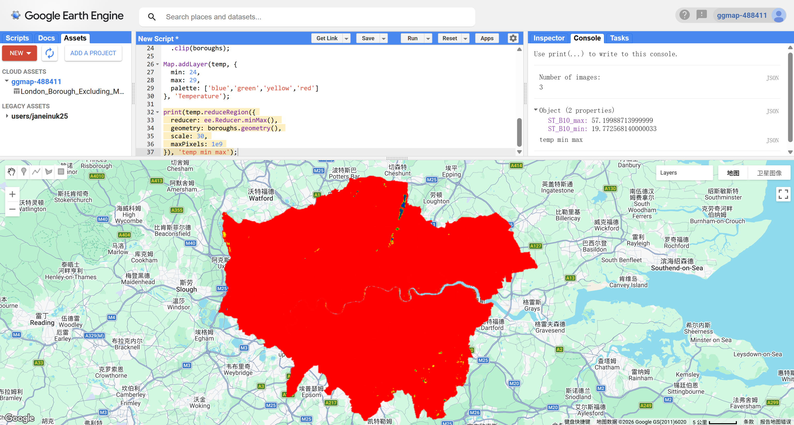
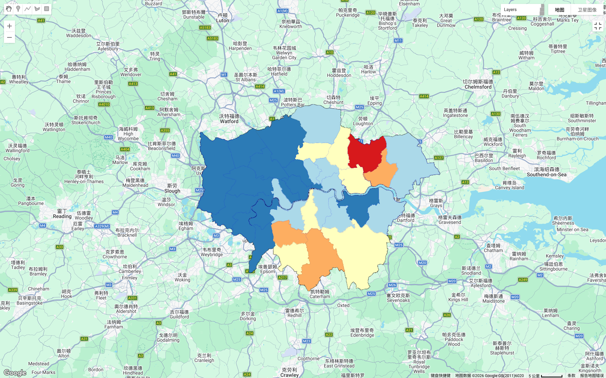

## Summary

This week focused on analysing urban temperature using remote sensing data in Google Earth Engine. As this was the final practical of the course, I chose London as my study area. Since London is the city where I am currently studying and living, this made the exercise more meaningful and allowed me to interpret spatial patterns based on familiar locations. Using London for the final practical also felt like a natural way to conclude the course, bringing together the skills learned throughout previous weeks.

### Study Area

London was selected as the study area due to its complex urban structure and diverse land cover. The city includes dense built-up areas, large parks, rivers, and suburban neighbourhoods, making it suitable for exploring urban heat patterns. In addition, London is frequently used in urban climate studies, making it easier to compare findings with previous research.

### Temperature Calculation

The practical used Landsat 8 imagery to calculate Land Surface Temperature (LST). The thermal band (ST_B10) was converted to Celsius using the formula provided in the practical. After filtering imagery for summer months, the temperature was calculated and clipped to the London borough boundary. This created a continuous temperature surface showing spatial temperature variation across London.

The continuous temperature map provided an overview of temperature variation across the city. However, the pattern was not very clear, and the temperature distribution appeared unrealistic in some areas. This made it difficult to interpret spatial differences and identify clear urban heat patterns.

### Borough-Level Aggregation

To improve interpretation, I calculated the mean temperature for each borough using `reduceRegions()`. This aggregated temperature values from pixel-level data to administrative boundaries, making the results easier to interpret. After calculating borough-level temperature, I classified boroughs into percentile categories to highlight temperature differences.

The percentile classification provided a clearer spatial pattern. Western London boroughs generally appeared cooler, while parts of central and eastern London showed higher temperature values. Interestingly, the hottest borough appeared in northeast London rather than in the city centre. This suggests that urban heat patterns may be influenced by land cover, vegetation, and built environment characteristics.

## Applications

Urban temperature analysis using remote sensing is widely used in urban heat island studies. Oke (1982) explains that urban heat islands occur due to reduced vegetation, impervious surfaces, and anthropogenic heat. Remote sensing provides an efficient way to measure temperature variation across large urban areas.

Voogt and Oke (2003) demonstrate how thermal remote sensing can be applied to analyse spatial temperature variation within cities. Their research highlights that satellite-derived temperature data can support urban planning decisions, such as identifying areas vulnerable to heat stress and improving green infrastructure.

In the case of London, temperature mapping could be used to support climate adaptation strategies, identify vulnerable neighbourhoods, and guide urban greening policies. This shows that remote sensing temperature analysis has practical applications in urban planning and environmental management.

## Reflection

This week helped me better understand how remote sensing can be used to analyse urban temperature patterns. I found it particularly interesting to see how satellite data can reveal spatial differences within a city. Using London made the results more engaging, as I could recognise different areas and relate them to real-world environments.

One interesting aspect was that the hottest area was not located in central London, which was slightly different from my expectations based on urban heat island theory. This made me realise that urban temperature patterns are more complex and influenced by factors such as land cover, vegetation, and built environment characteristics. It also highlighted the importance of not assuming expected results and instead carefully interpreting the data.

I also found the process of improving the map from a continuous temperature surface to a borough-level classification particularly useful. The first map was difficult to interpret, while the second map provided clearer spatial patterns. This demonstrated the importance of data aggregation and visualisation techniques in spatial analysis.

However, one challenge this week was that temperature calculation and visualisation required several steps, and it was sometimes difficult to determine whether the results were correct. This made the process slightly frustrating at times. Despite this, the final output was rewarding, especially when the spatial patterns became clearer.

Overall, I found this week's practical useful and relevant to urban studies. Urban temperature analysis could be helpful in future research, particularly in topics such as climate adaptation, urban planning, and environmental justice. Even if I do not directly use this exact method in the future, the skills learned in handling remote sensing data and interpreting spatial patterns will likely be valuable.

## References

Oke, T. R. (1982). The energetic basis of the urban heat island. *Quarterly Journal of the Royal Meteorological Society*, 108(455), 1–24.

Voogt, J. A., & Oke, T. R. (2003). Thermal remote sensing of urban climates. *Remote Sensing of Environment*, 86(3), 370–384.